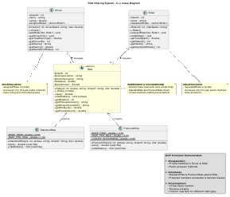

## Differences from C++ Implementation

### Syntax
- **C++**: `ride->fare()` (function call)
- **Smalltalk**: `ride fare` (message send)

### Class Definition
- **C++**: Header files (.h) + Implementation files (.cpp)
- **Smalltalk**: Single class definition, no separation

### Inheritance
- **C++**: `class StandardRide : public Ride`
- **Smalltalk**: `Ride subclass: #StandardRide`

### Polymorphism
- **C++**: Requires `virtual` keyword
- **Smalltalk**: All methods are inherited and can be overriden.

### Memory Management
- **C++**: Manual (`new`/`delete`)
- **Smalltalk**: Automatic garbage collection

### Type System
- **C++**: Static typing (compile-time checks)
- **Smalltalk**: Dynamic typing (runtime checks)

---

## Code Structure

### Ride (Abstract Base Class)
- Instance variables: `rideID`, `pickupLocation`, `dropoffLocation`, `distance`, `fareAmount`
- Abstract method: `fare` (marked with `subclassResponsibility`)
- Concrete method: `rideDetails`

### StandardRide (Derived Class)
- Inherits from `Ride`
- Class variables: `BaseFare` ($2.50), `RatePerMile` ($1.50)
- Overrides: `fare`, `rideDetails`

### PremiumRide (Derived Class)
- Inherits from `Ride`
- Class variables: `BaseFare` ($5.00), `RatePerMile` ($2.50), `LuxurySurcharge` ($3.00)
- Overrides: `fare`, `rideDetails`

### Driver (Encapsulation Example)
- Instance variables: `driverID`, `name`, `rating`, `assignedRides` (private collection)
- Methods: `addRide:`, `getDriverInfo`, `getTotalEarnings`

### Rider (Encapsulation Example)
- Instance variables: `riderID`, `name`, `requestedRides` (private collection)
- Methods: `requestRide:`, `viewRides`, `getTotalSpent`

